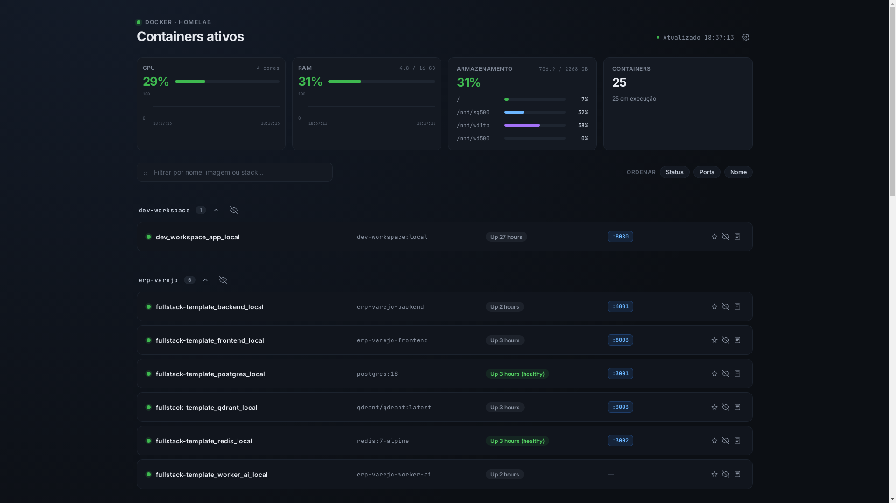

[](compose.yaml)
[](app.py)
[](https://opensource.org/licenses/MIT)

<br/>
<div align="center">

<h3 align="center">Homelab Homepage</h3>
<p align="center">
Dashboard leve para monitorar containers Docker, recursos do host e logs em tempo real.

<br/>
<br/>

<a href="https://github.com/davirezendemota/homelab-homepage/issues/new">Report Bug</a>
·
<a href="https://github.com/davirezendemota/homelab-homepage/issues/new">Request Feature</a>
</p>
</div>

## About The Project



Painel web minimalista para homelabs que lista containers Docker em execução, agrupados por stack do Docker Compose, com métricas do host e acesso rápido aos serviços.

Principais recursos:

- Visão geral de CPU, RAM, armazenamento e quantidade de containers
- Listagem agrupada por stack, com favoritos, ocultar stacks/containers e colapsar grupos
- Busca por nome, imagem ou stack; ordenação por colunas
- Links diretos para portas publicadas (HTTP/HTTPS)
- Logs em tempo real via streaming da Docker API, com copiar para área de transferência
- Atualização automática a cada 5 segundos e hot-reload ao editar `app.py` no bind mount
- Sem dependências Python além da stdlib; interface em HTML/CSS/JS embutido

### Built With

Stack enxuta, pensada para rodar como container único no host.

- [Python 3.12](https://www.python.org/)
- [Docker](https://www.docker.com/)
- [Docker Compose](https://docs.docker.com/compose/)
- [Watchdog](https://github.com/gorakhargosh/watchdog)

## Getting Started

A forma mais simples de subir o painel é via Docker Compose, montando o socket do Docker e a raiz do host (somente leitura) para métricas e mounts reais.

### Prerequisites

- Docker Engine com Compose v2
- Acesso de leitura ao socket `/var/run/docker.sock`
- Linux (testado em homelab; `group_add` no compose deve corresponder ao GID do grupo `docker` no host)

### Installation

1. Clone o repositório
   ```sh
   git clone git@github.com:davirezendemota/homelab-homepage.git
   cd homelab-homepage
   ```
2. Ajuste o `group_add` em `compose.yaml` para o GID do grupo docker do host (`getent group docker`)
3. Suba o serviço
   ```sh
   docker compose up -d --build
   ```
4. Acesse `http://<host>:80` (porta mapeada no compose)

**Variáveis de ambiente** (opcionais):

| Variável | Padrão | Descrição |
|----------|--------|-----------|
| `HOST` | `0.0.0.0` | Endereço de bind do servidor HTTP |
| `PORT` | `8000` | Porta interna do container |
| `DOCKER_SOCKET` | `/var/run/docker.sock` | Socket da API Docker |
| `HOST_ROOT` | `/host` | Raiz do host montada para leitura de disco |
| `DB_PATH` | `/app/data/homepage.db` | Caminho do banco SQLite de preferências |
| `TZ` | — | Fuso horário (ex.: `America/Sao_Paulo`) |

## Usage

O dashboard carrega automaticamente os containers ativos. Use a barra de busca para filtrar por nome, imagem ou stack.

- **Favoritos** — estrela ao lado do container; favoritos aparecem no topo
- **Ocultar** — esconda stacks ou containers individuais (preferências salvas no SQLite)
- **Logs** — botão de terminal abre modal com stream ao vivo (`/api/logs/<container>`)
- **Portas** — clique nos badges de porta para abrir o serviço no host

Durante desenvolvimento, `app.py` está montado como volume: salvar o arquivo recarrega o processo via Watchdog, sem rebuild da imagem.

**API**

- `GET /api/status` — JSON com containers e métricas
- `GET /api/prefs` — preferências (favoritos, ocultos, configurações)
- `PUT /api/prefs` — atualiza preferências (corpo JSON parcial)
- `GET /api/logs/<ref>` — stream de logs (stdout + stderr)

## Roadmap

- [x] Dashboard de containers agrupados por stack
- [x] Métricas de CPU, RAM e armazenamento
- [x] Busca, ordenação, favoritos e ocultar stacks
- [x] Logs em tempo real
- [x] Hot-reload em desenvolvimento
- [ ] Autenticação opcional na UI
- [ ] Suporte a múltiplos hosts Docker

See the [open issues](https://github.com/davirezendemota/homelab-homepage/issues) for a full list of proposed features (and known issues).

## Contributing

Contribuições são bem-vindas. Para mudanças maiores, abra uma issue primeiro para alinhar o escopo.

1. Faça fork do projeto
2. Crie uma branch (`git checkout -b feature/minha-feature`)
3. Commit (`git commit -m "feat: descrição"`)
4. Push (`git push origin feature/minha-feature`)
5. Abra um Pull Request

## License

Distributed under the MIT License. See [MIT License](https://opensource.org/licenses/MIT) for more information.

## Contact

Davi Rezende — [GitHub](https://github.com/davirezendemota)

Repositório: [https://github.com/davirezendemota/homelab-homepage](https://github.com/davirezendemota/homelab-homepage)

## Acknowledgments

Inspirações e ferramentas usadas neste projeto.

- [makeread.me](https://github.com/ShaanCoding/makeread.me)
- [Best README Template](https://github.com/othneildrew/Best-README-Template)

## Notice

This ReadMe was generated using [makeread.me](https://github.com/ShaanCoding/makeread.me).
